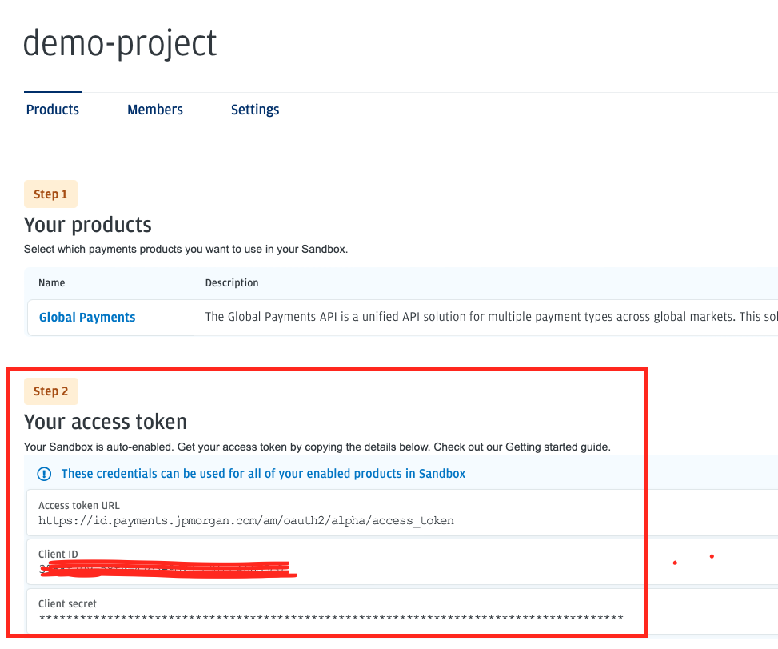
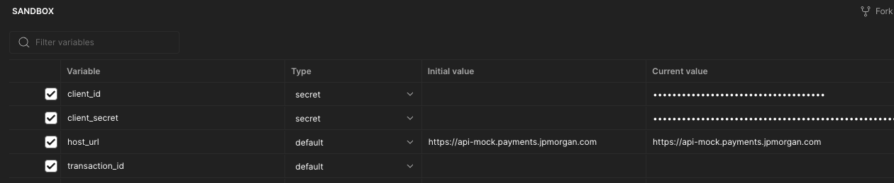
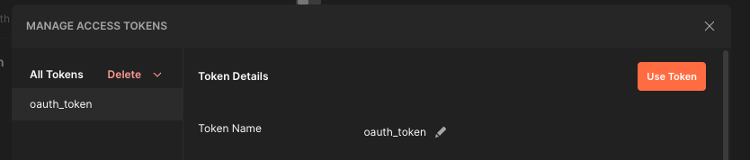
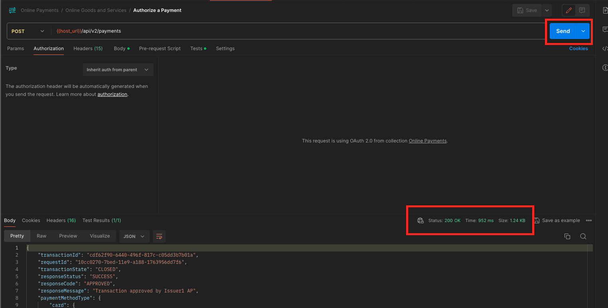

# Online Payments Postman Collection

We have created a postman collection for each of the calls made on the showcase application.

## Using this collection against our sandbox environment

1. Import both the collection and environment into postman. If you aren't sure how to do this, follow this guide [https://learning.postman.com/docs/getting-started/importing-and-exporting/importing-data/](https://learning.postman.com/docs/getting-started/importing-and-exporting/importing-data/).
2. Navigate to [https://developer.payments.jpmorgan.com](https://developer.payments.jpmorgan.com) and sign in.
3. Create a new project.
   Within this project you will have a Client ID and Client Secret provided.
   
4. Navigate to your postman environment and enter these details into the variables.
   
5. Navigate to your postman Collection and head to the authentication section.
   It should look like this:
   
6. Click 'Get access token' and you should see a new token generated. Then make sure to click 'use token' in the dialog below.
   
7. Open any of the requests and select 'send'.
   This should send a request to our APIs, if this is successful you should see the successful response.
   
